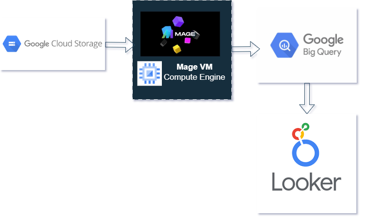

# Uber Data Analytics | Data Engineering GCP Project

## Introduction
The project leverages various tools and technologies on the Google Cloud Platform (GCP) to perform insightful data analytics. The goal of this project is to perform data analytics on Uber data using GCP Storage, Python, Compute Instance, Mage Data Pipeline Tool, BigQuery, and Looker Studio to analyze and visualize Uber trip records. The open-source nature of this project allows contributors to enhance and expand their capabilities, fostering collaboration and innovation.

## Architecture

The architecture illustrates the flow of data through various components, starting with data ingestion from the Uber dataset into GCP Storage. The Compute Instance processes the data using Python, and the Mage Data Pipeline Tool assists in orchestrating data workflows. The processed data is then loaded into BigQuery for further analysis. Looker Studio is employed for creating insightful dashboards based on the analyzed data.

## Technology Used

**Programming Language** 
- Python

**Google Cloud Platform**
1. Google Storage
2. Compute Instance
3. BigQuery
4. Looker Studio

**Modern Data Pipeline Tool** - An advanced data pipeline tool that facilitates seamless data workflows.
- Mage: https://www.mage.ai/

Contribute to this open-source project - https://github.com/mage-ai/mage-ai

## Dataset Used

TLC Trip Record Data Yellow and green taxi trip records include fields capturing pick-up and drop-off dates/times, pick-up and drop-off locations, trip distances, itemized fares, rate types, payment types, and driver-reported passenger counts.

Here is the dataset used in the project - https://raw.githubusercontent.com/Kavyagandhi23/Uber-Data-Analysis-GCP/main/uber_data.csv

More info about the dataset can be found here:
1. Website - https://www.nyc.gov/site/tlc/about/tlc-trip-record-data.page
2. Data Dictionary - https://www.nyc.gov/assets/tlc/downloads/pdf/data_dictionary_trip_records_yellow.pdf

## Data Model

The data model provides a visual representation of the relationships and structures within the Uber dataset.

## Looker Dashboard

Looker Dashboard Link: https://lookerstudio.google.com/reporting/5bcf42af-fc54-4d8c-bb1b-d8ad8ab7ee70

